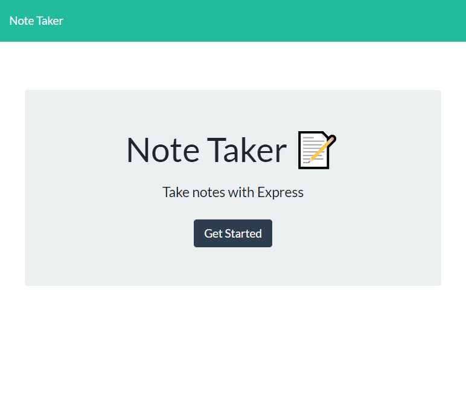

# Note-Taker

## Table of Contents

* [License](#license)
* [Links](#links)
* [My Usage](#my-usage)
* [Technology Used](#technology-used)
* [Screenshots](#screenshots)
* [Questions](#questions)
* [Credits](#credits)
 
  
## License

* 
  
## Links

* Heroku Deployed App: https://note-taker-heart-breaker.herokuapp.com/
* Github Repository: https://github.com/emacartoon/Note-Taker
  

## My Usage

This application is used to create notes that I can reference at a later date. I am also able to delete them when I have finished with the note. The notes persist after a refresh and are stored in a database file that doesn't clear until I end or reboot the server.
  

## Technology Used

Express.JS
  
  
## Screenshots

Screenshot of First Screen on Load

Screenshot of Notes Screen
  
## Questions

If you have any questions about this project, or happen to use this project, please reach out to me!
Email: emacartoon@gmail.com
GitHub: @EmaCartoon

## Credits

Help with syntax came from Tucker (Instructor), Clark (TA), Dylan Korte, Dan Lucas, and Nate Shipp.
